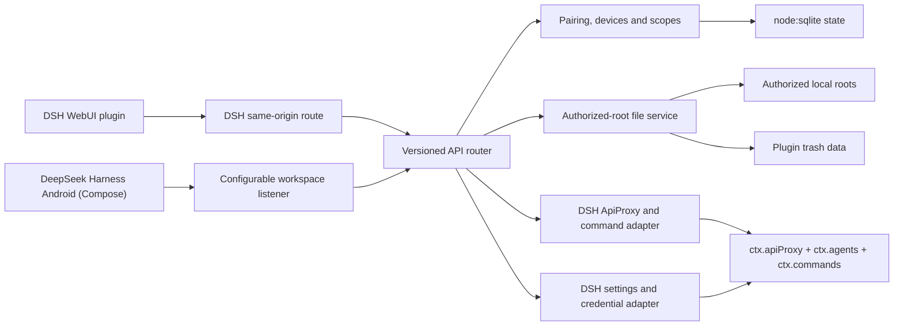

# 架构

## 组件

包同时声明 `dsh.bundle` 和 `dsh.client`。Profile patch 插入一个 Host row；DSH client module scanner 从同一包发现 `./client`，因此安装者只需执行一次 `dsh plugin add`。

Web Client 使用独立的外部语言 store 跨多个 DSH slot React 根同步界面语言，默认值为 `zh-CN`。语言按钮切换 `zh-CN`/`en` 并写入浏览器存储；slot 注册会随语言变化刷新标签，独立工作区同时更新文档标题和 `lang` 属性。

桌面端的「手机设置」**内联渲染在 DSH 自带设置页里**：入口是 `settings.section` 插槽（`id: dsh-remote-bridge`、`order: 2`，紧跟 pocket-relay 的「📱 手机访问」之下）。

为什么不套弹窗：早先的版本在设置页里放一个「打开手机设置面板」按钮，真正的设置藏在按钮后面的模态框里。用户点进去只看到一句话，直接问「其他的可以设置的东西那去了」—— **入口看起来是空的，因为内容在下一层**。设置页本身就是容器，把弹窗嵌进设置页是设计错误。所以 `PhoneSettingsBody`（导航栏 + 内容区，无对话框外壳）被抽出来，由设置页内联渲染；原先的 `shell.overlay` 弹窗链路、`WorkspacePanel` 与 `dsh-remote-bridge:open-panel` 事件已随之一并删除 —— 没有任何东西会再打开那个弹窗。

原先侧边栏 `sidebar.footer.action` 的齿轮按钮已删除：入口分散在侧栏图标和设置页两处会让同一件事有两个起点，现在远程访问、配对与客户端下载都收在设置页一处。面板左侧竖排导航依次是 根目录 / 远程访问 / 设备 / 回收站 / 审计 / App 下载 —— **不含文件树**：文件工作区已从面板移出。`App 下载` 刻意排在最后：它是给**新手机**准备的一次性目的地，不是日常管理页。

`WorkspaceApp` 与 `AdminOverlay` 仍导出给 `/dsh-workspace` 独立页（移动 WebView、直链、故障排查），文件树在那里依然可用 —— 它需要整个窗口，而不是一个设置对话框；`AdminOverlay` 自带外壳，因为独立页没有可内联渲染的设置容器。

`conversation.view` 插槽（会话内文件标签）不再注册。二维码来自 `src/client/app-qr.ts`（由 `scripts/generate-app-qr.mjs` 生成，勿手改）：以 data URL 内联 SVG，客户端零依赖、零网络请求，且指向 Releases **列表页**而非具体文件，所以发新版不必重新生成。
